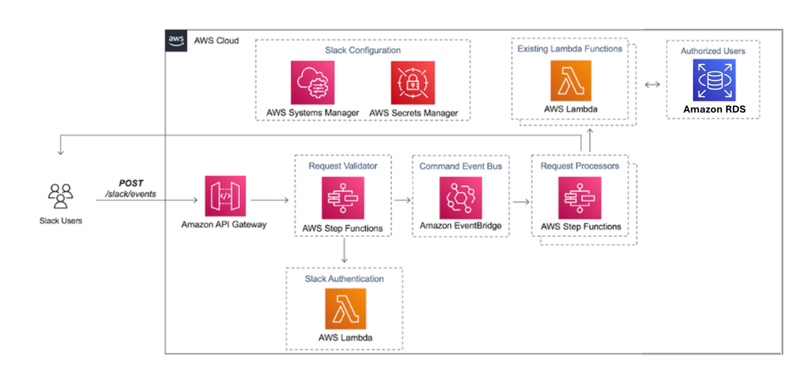
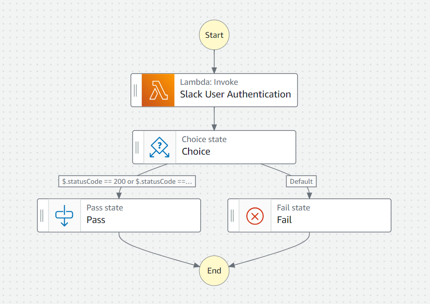
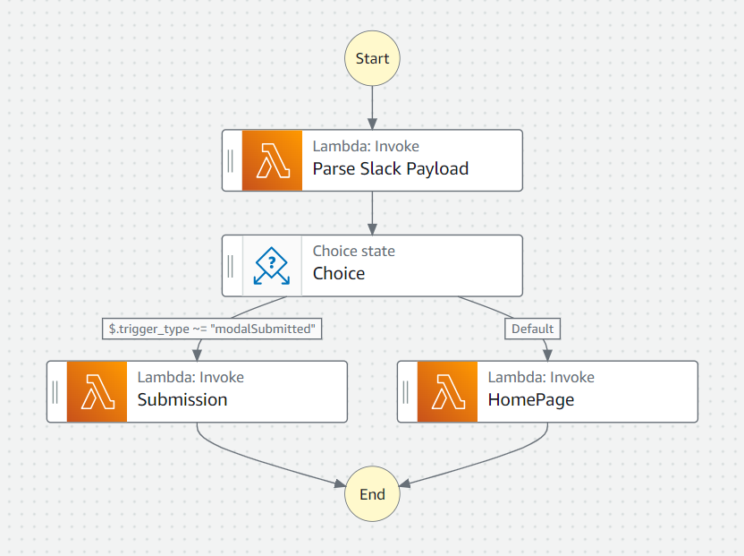

# FoundryRequests

This project contains source code and supporting files for four serverless applications (AWS Lambda functions) that are 
a part of the AWS architecture for a Slack application where other teams within our company's R&D can request 
boilerplate experiments for our Foundry team to execute. The homepage of the application lists out all of the available 
experiments to request, and upon clicking an associated "Request" button, the user is prompted to submit the request
with the name of the experiment. After submission, a new experiment is created in our electronic lab notebook hosted
on LabGuru's website and a dedicated Slack channel is created for the Foundry manager, requester, and any other involved 
personnel to collaborate on the experiment.

This repository includes the following directories, each one is a Lambda function:

- AuthandResponse - Confirms that the Slack request is coming from someone in our company's Slack Workspace. This 
function also deploys the modal (aka pop-up) after a "Request" button is clicked. This response functionality was added 
because this Lambda is the first Lambda triggered by the app, and Slack modals must respond within 3 seconds of a Slack app button click.
- HomePage - Loads the Slack homepage with a list of requestable experiments and associated "Request" buttons.
- SlackEventParser - Interprets the event payload sent from Slack as it is passed from one AWS Step Function to another.
- Submission - Creates an experiment in our LabGuru electronic lab notebook website and creates a dedicated Slack 
channel for the request.

The template.yaml file is a template that defines the application's AWS resource deployment and is used by Pycharm's AWS Toolkit 
to package the four directories into Docker containers that are synced with the associated AWS Lambda functions.

## AWS Serverless Architecture and Resources

These lambda functions operate within the scope of the AWS architecture designed below. The architecture was based on the AWS Well Architected Framework for a serverless app with some modifications to better fit my use case.

The first StepFunction that is triggered by the API Gateway and verifies that the request is coming from someone within my company:

The second StepFunction that handles the bulk of the actual work to submit a request and load the app homepage:
